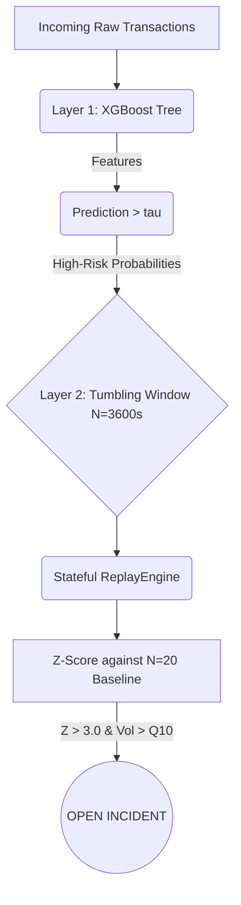

# AI Fraud Spike Detector 🛡️

A stateful, chronological AI detection system designed to identify rapid, concentrated bursts of automated financial fraud (Spike Attacks) in streaming transaction environments.

Unlike traditional anomaly detection that scores individual transactions in a vacuum, this system employs a Two-Layer Architecture that marries discriminative machine learning with stateful temporal aggregation to catch sophisticated, multi-card botnet attacks as they happen.

## Architecture



## Methodology & Leakage Controls

The system was evaluated strictly on the **IEEE-CIS Fraud Detection dataset** utilizing a pristine, chronological evaluation framework to prevent target leakage and data snooping:
* **70 / 15 / 15 Chronological Split**: The dataset was sliced across time without random shuffling.
* **Tumbling Windows**: Layer 2 uses strictly discrete, non-overlapping tumbling windows to prevent forward-leakage during rolling history calculations.
* **Deterministic Hashes**: All artifacts (`xgb_layer1.json`, `calibration.pkl`) were fingerprinted via SHA-256 (`spike_manifest.json`) prior to validation/test phases to guarantee zero retuning on test labels.

## Final Held-Out Test Results

The system was evaluated over the fully unseen chronological test split (N=88,580 transactions).

**Headline Layer-2 Spike Event Detection (Test vs Validation)**:
- **Strict Incident Precision**: 21.05% (Test) | 37.9% (Val)
- **Strict Incident Recall**: 47.05% (Test) | 68.8% (Val)
- **False-Alert Window Rate**: 3.71% (Test) | 2.60% (Val)

*Note: The mild degradation reflects the increase in underlying background fraud prevalence from the Validation subset to the final chronological Test subset, proving generalization without total distribution collapse.*


## Installation

This project requires Python 3.10+

1. Create a virtual environment:
   ```bash
   python -m venv venv
   # Windows
   venv\Scripts\activate
   # Linux/Mac
   source venv/bin/activate
   ```
2. Install strictly locked dependencies:
   ```bash
   pip install -r requirements.txt
   ```

## Project Structure

* `run_phase[1-6].py` - Original chronological orchestration scripts (frozen).
* `run_demo.py` - Single entry-point demo script.
* `app.py` - Streamlit dashboard.
* `src/fraud_spike/` - Machine learning and stateful logic source code.
* `tests/` - High-coverage pytest suite asserting leakage boundaries.
* `artifacts/` - Immutable frozen model states and replay telemetry.

## Running the Project

### 1. Execute Regression Tests
Ensure the code passes all boundary, schema, and cryptographic hashing tests before proceeding.
```bash
pytest tests/
```

### 2. Prepare the Demo
Verify the existence of frozen artifacts (or optionally regenerate them).
```bash
# Verifies test_replay_windows.parquet exists
python run_demo.py

# Optional: Force recalculation through the test engine
python run_demo.py --replay
```

### 3. Launch Dashboard
Start the Streaming Replay Monitor dashboard to chronologically step through the final held-out test evaluation.
```bash
streamlit run app.py
```

## Important Caveats & Ground Truth
- **Offline Evaluation**: The IEEE-CIS dataset's `isFraud` labels are used ONLY for offline proxy ground-truth evaluation to score the Spike Detector's performance. They are never ingested by the live streaming simulation.
- **Illustrative Cost Scenarios**: Any financial or business cost figures shown in the dashboard are illustrative and highly dataset-specific.
